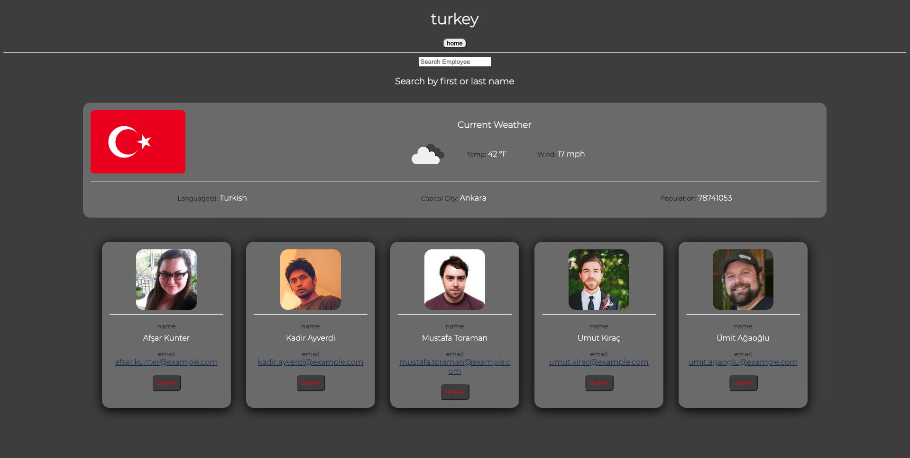

# react-client-directory

>## Description 

* Keep track of your clients around the world. Search clients by name or find all clients from the same country.
* #### Story
    * AS A: Business owner
    * I WANT: An easy to use tool to track track my clients
    * SO THAT: I can find client data easly and maintain custmer relationships.

 

>## Table of Contents

* [Contributing](#Contributing)
* [Description](#Description)
* [Installation](#Installation)
* [License](#License)
* [Questions](#Questions)
* [Story](#Story)
* [Testing](#Testing)
* [Usage](#Usage)
 

 

 

>## Product

* [Check it out!](https://react-client-directory.herokuapp.com/) 

 

>## Usage

1. On page load, random client data is loaded and displayed mimicking client data.

2. The random clients are sorted alphabetically by first name and displayed to the page with data for:

   - profile picture
   - first and last name
   - country location in the form of a link
   - email address in the form of a link to send an email to the client
   - button to delete client

3. A search bar at the top allows a user to search for clients by first or last name.

4. When a client's country link is selected, the page is redirected to '/:country' where the country name is used to retrieve data and general weather conditions about the country.

5. Country data is displayed to page as:

- image of flag
- icon resembling current general weather
- temperature in farenheight
- wind speed in m.p.h.
- Languagesd spoken in country
- Capital City
- Population

5. In addition to the country data, only clients from the same country will be displayed.

6. The search bar at the top of this page is the same as the home page, allowing a user to search clients from the same country by first or last name.

7. When the home button is clicked, the user is taken back to the main page, displaying all clients again.

8. The delete button will simply delete a client from the database.

9. Client data in this demo will stay the same until the page is refreshed and new random clients are loaded.

10. Website is responsive with a mobile first approach to accomodate all screen sizes.

 

>## Contributing

* [Submit bugs and feature requests](https://github.com/samuelfox1/react-client-directory/issues)
* [Review changes](https://github.com/samuelfox1/react-client-directory/pulls)
* [Contributor Covenant Code of Conduct](https://www.contributor-covenant.org/)

 

>## Questions

| Name | Email  | Github  | LinkedIn |
| :--: | :----: | :-----: | :------: |
| Samuel Jason Fox | samueljasonfox@gmail.com |  |  |

 

>## License

MIT License

Copyright 2021 Samuel Jason Fox

Permission is hereby granted, free of charge, to any person obtaining a copy of this software and associated documentation files (the "Software"), to deal in the Software without restriction, including without limitation the rights to use, copy, modify, merge, publish, distribute, sublicense, and/or sell copies of the Software, and to permit persons to whom the Software is furnished to do so, subject to the following conditions:

The above copyright notice and this permission notice shall be included in all copies or substantial portions of the Software.

THE SOFTWARE IS PROVIDED "AS IS", WITHOUT WARRANTY OF ANY KIND, EXPRESS OR IMPLIED, INCLUDING BUT NOT LIMITED TO THE WARRANTIES OF MERCHANTABILITY, FITNESS FOR A PARTICULAR PURPOSE AND NONINFRINGEMENT. IN NO EVENT SHALL THE AUTHORS OR COPYRIGHT HOLDERS BE LIABLE FOR ANY CLAIM, DAMAGES OR OTHER LIABILITY, WHETHER IN AN ACTION OF CONTRACT, TORT OR OTHERWISE, ARISING FROM, OUT OF OR IN CONNECTION WITH THE SOFTWARE OR THE USE OR OTHER DEALINGS IN THE SOFTWARE.

 

The images found in 'assets/images/logo/' are trademarks of their respective companies and are under their terms and license.
 

2021
 

>## [Top of page](#react-client-directory)